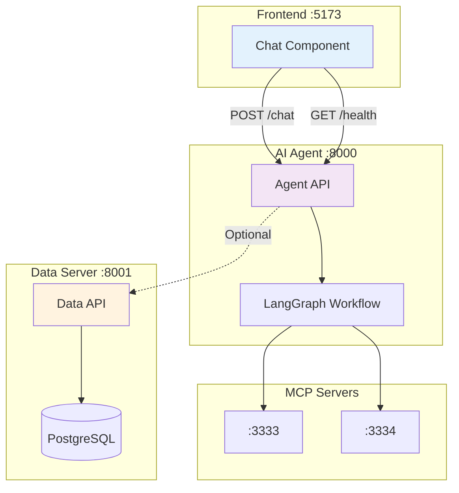

# 🤖 AI Agent Integration Guide

> **מדריך שלב-אחר-שלב** לאינטגרציה של AI Agent עם המערכת הראשית

---

## 📋 תוכן עניינים

1. [סקירה כללית](#-סקירה-כללית)
2. [דרישות מקדימות](#-דרישות-מקדימות)
3. [הכנת AI Agent](#-הכנת-ai-agent)
4. [אינטגרציה עם Frontend](#-אינטגרציה-עם-frontend)
5. [אינטגרציה עם Backend](#-אינטגרציה-עם-backend)
6. [הגדרת Environment Variables](#-הגדרת-environment-variables)
7. [הגדרת Docker Compose](#-הגדרת-docker-compose)
8. [בדיקות](#-בדיקות)
9. [Troubleshooting](#-troubleshooting)
10. [Security Considerations](#-security-considerations)

---

## 🎯 סקירה כללית

### מה נדרש לאינטגרציה?



### סטטוס נוכחי

✅ **מוכן:**
- Frontend ChatBot component (`front/src/components/ChatBot.jsx`)
- Chat Service API (`front/src/api/chatService.js`)
- Environment variable support (`VITE_AI_AGENT_URL`)
- Documentation (back/README.MD, ENV_TEMPLATE.md)

⏳ **נדרש מה-AI Agent Developer:**
- הוספת endpoints: `/chat`, `/health`
- WebSocket endpoint: `/ws/chat` (אופציונלי)
- Error handling
- Session management

---

## 📦 דרישות מקדימות

### 1. כלים
- Python 3.12+
- Poetry (dependency management)
- Docker Desktop (אם רוצים לעבוד עם Docker)
- PowerShell / Terminal

### 2. API Keys
- **OpenAI API Key** - לגישה ל-GPT-4o-mini
  - קבל מ: https://platform.openai.com/api-keys
- **Tavily API Key** - לWeb Search
  - קבל מ: https://tavily.com/

### 3. Ports Available
וודא שהפורטים הבאים פנויים:
- `8000` - AI Agent
- `3333` - Web Search MCP
- `3334` - Math MCP

---

## 🚀 הכנת AI Agent

### שלב 1: הכנת הסביבה

```powershell
# 1. עבור לתיקיית AI Agent
cd back\Ai_agent

# 2. התקן dependencies
poetry install

# 3. צור קובץ .env
notepad .env
```

### שלב 2: הגדרת Environment Variables

צור `back/Ai_agent/.env`:

```env
# OpenAI Configuration
OPENAI_API_KEY=sk-proj-xxxxxxxxxxxxxxxxxxxxxxxxxxxxxxxx

# Tavily Configuration (for Web Search MCP)
TAVILY_API_KEY=tvly-xxxxxxxxxxxxxxxxxxxxxxxxxxxxxxxx

# MCP Servers URLs
WEB_SEARCH_MCP_URL=http://localhost:3333/mcp
MATH_MCP_URL=http://localhost:3334/mcp

# Data Server Integration (Optional)
DATA_SERVER_URL=http://localhost:8001
DATA_SERVER_TIMEOUT=30

# Server Configuration
HOST=0.0.0.0
PORT=8000
RELOAD=true

# Logging
LOG_LEVEL=INFO
```

### שלב 3: הוספת API Endpoints

צור או ערוך את `back/Ai_agent/server.py` (אם לא קיים):

```python
from fastapi import FastAPI, HTTPException, WebSocket, WebSocketDisconnect
from fastapi.middleware.cors import CORSMiddleware
from pydantic import BaseModel
from datetime import datetime
import logging

# Import your LangGraph logic
from graph.graph import graph  # התאם לפי המבנה שלך
from graph.state import GraphState

app = FastAPI(title="OmerOpsMap AI Agent", version="1.0.0")

# CORS Configuration - מאפשר גישה מהFrontend
app.add_middleware(
    CORSMiddleware,
    allow_origins=[
        "http://localhost:5173",  # Development
        "http://localhost:3000",  # Alternative dev port
        # הוסף את הdomain של הפרודקשן
    ],
    allow_credentials=True,
    allow_methods=["*"],
    allow_headers=["*"],
)

logger = logging.getLogger(__name__)

# ============================================
# Models (Pydantic Schemas)
# ============================================

class ChatRequest(BaseModel):
    """Request model for chat endpoint"""
    message: str
    session_id: str

class ChatResponse(BaseModel):
    """Response model for chat endpoint"""
    response: str
    timestamp: datetime
    session_id: str

class HealthResponse(BaseModel):
    """Health check response"""
    status: str
    version: str
    timestamp: datetime

# ============================================
# Endpoints
# ============================================

@app.get("/health", response_model=HealthResponse)
async def health_check():
    """
    Health check endpoint.
    Frontend uses this to verify AI Agent is available.
    """
    return HealthResponse(
        status="ok",
        version="1.0.0",
        timestamp=datetime.now()
    )

@app.post("/chat", response_model=ChatResponse)
async def chat_endpoint(request: ChatRequest):
    """
    Main chat endpoint.
    Receives user message and returns AI response.
    """
    try:
        # Initialize state
        initial_state = GraphState(
            query=request.message,
            session_id=request.session_id,
            # הוסף שדות נוספים לפי הצורך
        )
        
        # Run LangGraph workflow
        result = await graph.ainvoke(initial_state)
        
        # Extract response
        response_text = result.get("final_answer", "מצטער, לא הצלחתי לעבד את השאלה.")
        
        return ChatResponse(
            response=response_text,
            timestamp=datetime.now(),
            session_id=request.session_id
        )
        
    except Exception as e:
        logger.error(f"Error in chat endpoint: {e}", exc_info=True)
        raise HTTPException(
            status_code=500,
            detail=f"שגיאה בעיבוד הבקשה: {str(e)}"
        )

@app.websocket("/ws/chat")
async def chat_websocket(websocket: WebSocket):
    """
    WebSocket endpoint for real-time streaming (Optional).
    Allows streaming responses token-by-token.
    """
    await websocket.accept()
    
    try:
        while True:
            # Receive message from client
            data = await websocket.receive_json()
            message = data.get("message")
            session_id = data.get("session_id")
            
            if not message:
                await websocket.send_json({
                    "error": "Message is required"
                })
                continue
            
            # TODO: Implement streaming logic with LangGraph
            # For now, simple echo
            await websocket.send_json({
                "type": "start",
                "session_id": session_id
            })
            
            # Simulate streaming (replace with actual LangGraph streaming)
            response = "This is a streaming response..."
            for chunk in response.split():
                await websocket.send_json({
                    "type": "chunk",
                    "content": chunk + " "
                })
            
            await websocket.send_json({
                "type": "end",
                "session_id": session_id
            })
            
    except WebSocketDisconnect:
        logger.info("WebSocket disconnected")
    except Exception as e:
        logger.error(f"WebSocket error: {e}", exc_info=True)
        await websocket.close()

# ============================================
# Optional: Data Server Integration
# ============================================

@app.get("/api/sites/search")
async def search_sites(query: str):
    """
    Example: AI Agent can query Data Server for site information.
    Useful for answering questions about locations.
    """
    import httpx
    import os
    
    data_server_url = os.getenv("DATA_SERVER_URL", "http://localhost:8001")
    
    try:
        async with httpx.AsyncClient() as client:
            response = await client.get(
                f"{data_server_url}/api/permanent-sites"
            )
            sites = response.json()
            
            # Filter by query
            filtered = [
                site for site in sites
                if query.lower() in site.get("name", "").lower()
            ]
            
            return {"results": filtered[:5]}  # Return top 5
            
    except Exception as e:
        logger.error(f"Error querying data server: {e}")
        return {"results": [], "error": str(e)}

# ============================================
# Startup/Shutdown Events
# ============================================

@app.on_event("startup")
async def startup_event():
    logger.info("AI Agent starting up...")
    # Initialize MCP connections, etc.

@app.on_event("shutdown")
async def shutdown_event():
    logger.info("AI Agent shutting down...")
    # Cleanup

if __name__ == "__main__":
    import uvicorn
    uvicorn.run(
        "server:app",
        host="0.0.0.0",
        port=8000,
        reload=True
    )
```

### שלב 4: הרצת MCP Servers

פתח 2 טרמינלים נפרדים:

**טרמינל 1 - Web Search MCP:**
```powershell
cd back\MCP_servers\web_search
poetry install
poetry run python server.py
```

**טרמינל 2 - Math MCP:**
```powershell
cd back\MCP_servers\math
poetry install
poetry run python server.py
```

### שלב 5: הרצת AI Agent

```powershell
cd back\Ai_agent
poetry run uvicorn server:app --host 0.0.0.0 --port 8000 --reload
```

### שלב 6: בדיקה ראשונית

```powershell
# בדיקת health
curl http://localhost:8000/health

# צריך להחזיר:
# {"status":"ok","version":"1.0.0","timestamp":"2026-01-11T..."}

# בדיקת chat endpoint
curl -X POST http://localhost:8000/chat `
  -H "Content-Type: application/json" `
  -d '{"message":"שלום","session_id":"test123"}'
```

---

## 🎨 אינטגרציה עם Frontend

### הקוד כבר מוכן! ✅

הFrontend כבר כולל את כל מה שצריך:

**1. ChatBot Component:** `front/src/components/ChatBot.jsx`
- UI מלוטש עם אנימציות
- Auto-scroll, typing indicator
- Error handling

**2. Chat Service:** `front/src/api/chatService.js`
- `sendChatMessage()` - קריאה ל-AI Agent
- `checkAIAgentHealth()` - בדיקת זמינות
- `connectChatWebSocket()` - WebSocket support

**3. Integration:** `front/src/app/App.jsx`
- ChatBot כבר מחובר לApp

### עדכון הChatBot לשימוש אמיתי

ערוך `front/src/components/ChatBot.jsx`:

```jsx
// מצא את השורות עם TODO (שורות 32-45)
// החלף את המוק הזה:
await new Promise((resolve) => setTimeout(resolve, 1000));
const botResponse = 'תודה על ההודעה! השירות יחובר בקרוב. 🤖';

// ב:
import { sendChatMessage } from '../api/chatService';
const response = await sendChatMessage(userMessage.text);
const botResponse = response.response;
```

### הגדרת URL של AI Agent

**אופציה 1: Environment Variable (מומלץ)**

צור `front/.env.local`:
```env
VITE_AI_AGENT_URL=http://localhost:8000
```

**אופציה 2: קובע ב-code**

ערוך `front/src/api/chatService.js`:
```javascript
const AI_AGENT_URL = 'http://localhost:8000';
```

---

## 🔗 אינטגרציה עם Backend (Data Server)

### למה זה שימושי?

AI Agent יכול לשלוף מידע מהData Server כדי לענות על שאלות על:
- אתרים במפה
- אירועים זמניים
- סטטיסטיקות
- מיקומים

### דוגמה: שאילתת אתרים

ב-`back/Ai_agent/server.py` הוספנו endpoint:

```python
@app.get("/api/sites/search")
async def search_sites(query: str):
    # Query Data Server
    ...
```

### שימוש ב-LangGraph Tools

הוסף כלי ל-LangGraph שמבצע שאילתות:

```python
# back/Ai_agent/graph/tools/data_server_tool.py
import httpx
import os

async def search_omer_sites(query: str) -> str:
    """
    חיפוש אתרים במערכת OmerOpsMap.
    
    Args:
        query: מילת חיפוש (שם אתר, קטגוריה וכו')
    
    Returns:
        JSON עם רשימת אתרים רלוונטיים
    """
    data_server_url = os.getenv("DATA_SERVER_URL", "http://localhost:8001")
    
    try:
        async with httpx.AsyncClient(timeout=10.0) as client:
            response = await client.get(
                f"{data_server_url}/api/permanent-sites"
            )
            sites = response.json()
            
            # Filter by query
            filtered = [
                {
                    "name": site["name"],
                    "category": site.get("category"),
                    "address": f"{site.get('street', '')} {site.get('house_number', '')}",
                    "lat": site["lat"],
                    "lng": site["lng"]
                }
                for site in sites
                if query.lower() in site.get("name", "").lower() or
                   query.lower() in site.get("category", "").lower()
            ]
            
            if not filtered:
                return f"לא נמצאו אתרים התואמים ל: {query}"
            
            # Return formatted list
            result = f"נמצאו {len(filtered)} אתרים:\n"
            for site in filtered[:5]:  # Top 5
                result += f"- {site['name']} ({site['category']}) - {site['address']}\n"
            
            return result
            
    except Exception as e:
        return f"שגיאה בחיפוש אתרים: {str(e)}"
```

רשום את הכלי ב-LangGraph:

```python
# back/Ai_agent/graph/tools/__init__.py
from .data_server_tool import search_omer_sites

AVAILABLE_TOOLS = [
    search_omer_sites,
    # ... other tools
]
```

---

## 🔐 הגדרת Environment Variables

### קובץ ראשי: `.env`

עדכן `.env` בתיקייה הראשית:

```env
# ============================================
# OmerOpsMap - Environment Variables
# ============================================

# Data Server (existing)
SECRET_KEY=your-super-secret-key-change-this-in-production-12345
ALLOWED_ORIGINS=http://localhost:5173,http://localhost:3000
INITIAL_ADMIN_USERNAME=admin
INITIAL_ADMIN_PASSWORD=Admin123!

# AI Agent (new)
OPENAI_API_KEY=sk-proj-xxxxxxxxxxxxxxxxxxxxxxxxxxxxxxxx
TAVILY_API_KEY=tvly-xxxxxxxxxxxxxxxxxxxxxxxxxxxxxxxx
```

### Frontend: `front/.env.local`

```env
VITE_AI_AGENT_URL=http://localhost:8000
```

### AI Agent: `back/Ai_agent/.env`

```env
OPENAI_API_KEY=sk-proj-xxxxxxxxxxxxxxxxxxxxxxxxxxxxxxxx
TAVILY_API_KEY=tvly-xxxxxxxxxxxxxxxxxxxxxxxxxxxxxxxx
WEB_SEARCH_MCP_URL=http://localhost:3333/mcp
MATH_MCP_URL=http://localhost:3334/mcp
DATA_SERVER_URL=http://localhost:8001
```

---

## 🐳 הגדרת Docker Compose

כשהכל מוכן, הוסף את ה-AI Agent ל-`docker-compose.yml`:

```yaml
version: "3.8"

services:
  # ============================================
  # Existing Services
  # ============================================
  
  postgres:
    # ... (existing)
  
  data_server:
    # ... (existing)
  
  frontend:
    # ... (existing)
  
  # ============================================
  # AI Agent Services (NEW)
  # ============================================
  
  ai_agent:
    build:
      context: ./back/Ai_agent
      dockerfile: Dockerfile
    container_name: omeropsmap_ai_agent
    ports:
      - "8000:8000"
    environment:
      - OPENAI_API_KEY=${OPENAI_API_KEY}
      - TAVILY_API_KEY=${TAVILY_API_KEY}
      - WEB_SEARCH_MCP_URL=http://web_search_mcp:3333/mcp
      - MATH_MCP_URL=http://math_mcp:3334/mcp
      - DATA_SERVER_URL=http://data_server:8001
      - HOST=0.0.0.0
      - PORT=8000
    depends_on:
      - data_server
      - web_search_mcp
      - math_mcp
    networks:
      - omeropsmap_network
    restart: unless-stopped
  
  web_search_mcp:
    build:
      context: ./back/MCP_servers/web_search
      dockerfile: Dockerfile
    container_name: omeropsmap_web_search
    ports:
      - "3333:3333"
    environment:
      - TAVILY_API_KEY=${TAVILY_API_KEY}
      - PORT=3333
    networks:
      - omeropsmap_network
    restart: unless-stopped
  
  math_mcp:
    build:
      context: ./back/MCP_servers/math
      dockerfile: Dockerfile
    container_name: omeropsmap_math
    ports:
      - "3334:3334"
    environment:
      - PORT=3334
    networks:
      - omeropsmap_network
    restart: unless-stopped

networks:
  omeropsmap_network:
    driver: bridge
```

### Dockerfiles נדרשים

**`back/Ai_agent/Dockerfile`:**
```dockerfile
FROM python:3.12-slim

WORKDIR /app

# Install Poetry
RUN pip install poetry

# Copy dependency files
COPY pyproject.toml poetry.lock ./

# Install dependencies
RUN poetry config virtualenvs.create false \
    && poetry install --no-dev --no-interaction --no-ansi

# Copy application
COPY . .

# Expose port
EXPOSE 8000

# Run server
CMD ["uvicorn", "server:app", "--host", "0.0.0.0", "--port", "8000"]
```

**`back/MCP_servers/web_search/Dockerfile`:**
```dockerfile
FROM python:3.12-slim

WORKDIR /app

RUN pip install poetry

COPY pyproject.toml poetry.lock ./
RUN poetry config virtualenvs.create false \
    && poetry install --no-dev

COPY . .

EXPOSE 3333

CMD ["python", "server.py"]
```

**`back/MCP_servers/math/Dockerfile`:**
```dockerfile
FROM python:3.12-slim

WORKDIR /app

RUN pip install poetry

COPY pyproject.toml poetry.lock ./
RUN poetry config virtualenvs.create false \
    && poetry install --no-dev

COPY . .

EXPOSE 3334

CMD ["python", "server.py"]
```

---

## ✅ בדיקות

### 1. בדיקת MCP Servers

```powershell
# Web Search MCP
curl http://localhost:3333/mcp

# Math MCP
curl http://localhost:3334/mcp

# צריך להחזיר JSON עם status
```

### 2. בדיקת AI Agent

```powershell
# Health check
curl http://localhost:8000/health

# Chat endpoint
curl -X POST http://localhost:8000/chat `
  -H "Content-Type: application/json" `
  -d '{
    "message": "מהי עומר?",
    "session_id": "test_session_123"
  }'
```

### 3. בדיקת Frontend Integration

1. פתח http://localhost:5173
2. לחץ על כפתור הצ'אט 💬 (שמאל למטה)
3. שלח הודעה: "שלום!"
4. בדוק שמתקבלת תשובה מה-AI

### 4. בדיקת Docker Compose

```powershell
# הפעלה
docker-compose up -d

# בדיקת logs
docker-compose logs -f ai_agent
docker-compose logs -f web_search_mcp
docker-compose logs -f math_mcp

# בדיקת סטטוס
docker-compose ps

# צריך לראות:
# omeropsmap_ai_agent      Up
# omeropsmap_web_search    Up
# omeropsmap_math          Up
```

---

## 🔧 Troubleshooting

### בעיה: AI Agent לא עונה

**תסמינים:** Frontend מציג "שירות הצ'אט אינו זמין"

**פתרון:**
```powershell
# בדוק שה-AI Agent רץ
curl http://localhost:8000/health

# אם לא עונה, בדוק logs:
docker-compose logs ai_agent

# אם רץ בלי Docker:
cd back\Ai_agent
poetry run uvicorn server:app --host 0.0.0.0 --port 8000
```

### בעיה: CORS Error

**תסמינים:** בקונסול הדפדפן (F12):
```
Access to fetch at 'http://localhost:8000/chat' from origin 'http://localhost:5173' 
has been blocked by CORS policy
```

**פתרון:** ב-`back/Ai_agent/server.py`:
```python
app.add_middleware(
    CORSMiddleware,
    allow_origins=["http://localhost:5173"],  # ✅ הוסף את זה!
    allow_credentials=True,
    allow_methods=["*"],
    allow_headers=["*"],
)
```

### בעיה: OpenAI API Error

**תסמינים:** `AuthenticationError: Incorrect API key`

**פתרון:**
1. וודא שה-API key נכון ב-`.env`
2. בדוק שלא פג תוקף המפתח
3. נסה key חדש: https://platform.openai.com/api-keys

### בעיה: MCP Server לא מגיב

**פתרון:**
```powershell
# בדוק אם התהליך רץ
netstat -ano | findstr :3333
netstat -ano | findstr :3334

# אם לא רץ, הפעל מחדש:
cd back\MCP_servers\web_search
poetry run python server.py

# בטרמינל נפרד:
cd back\MCP_servers\math
poetry run python server.py
```

### בעיה: Port Already in Use

**תסמינים:** `[Errno 10048] Only one usage of each socket address`

**פתרון:**
```powershell
# מצא מי משתמש בport
netstat -ano | findstr :8000

# עצור את התהליך (החלף PID):
taskkill /F /PID <PID>
```

---

## 🔒 Security Considerations

### 1. API Keys
- ❌ **לעולם** אל תעלה `.env` ל-Git
- ✅ השתמש ב-`.env.example` כtemplate
- ✅ סובב מפתחות בפרודקשן

### 2. CORS
```python
# Development - מאפשר localhost
allow_origins=["http://localhost:5173"]

# Production - הגבל לדומיין שלך
allow_origins=["https://omeropsmap.example.com"]
```

### 3. Rate Limiting
הוסף rate limiting ל-AI Agent:

```python
from slowapi import Limiter, _rate_limit_exceeded_handler
from slowapi.util import get_remote_address

limiter = Limiter(key_func=get_remote_address)
app.state.limiter = limiter

@app.post("/chat")
@limiter.limit("10/minute")  # 10 בקשות לדקה
async def chat_endpoint(request: ChatRequest):
    ...
```

### 4. Input Validation
וודא validation של כל input מהמשתמש:

```python
class ChatRequest(BaseModel):
    message: str = Field(..., min_length=1, max_length=500)
    session_id: str = Field(..., regex="^[a-zA-Z0-9_-]+$")
```

### 5. Error Messages
אל תחשוף פרטים טכניים ל-client:

```python
except Exception as e:
    logger.error(f"Internal error: {e}", exc_info=True)
    # ❌ לא כך:
    # raise HTTPException(detail=str(e))
    
    # ✅ כך:
    raise HTTPException(
        status_code=500,
        detail="אירעה שגיאה בשרת. נסה שוב מאוחר יותר."
    )
```

---

## 📝 סיכום - Checklist

לפני שנכנסים לפרודקשן:

### AI Agent Developer
- [ ] הוספת `/chat` endpoint
- [ ] הוספת `/health` endpoint
- [ ] (אופציונלי) WebSocket `/ws/chat`
- [ ] Error handling מקיף
- [ ] Logging מתאים
- [ ] Tests

### DevOps / Integration
- [ ] הגדרת API keys ב-`.env`
- [ ] CORS מוגדר נכון
- [ ] Dockerfiles מוכנים
- [ ] `docker-compose.yml` עודכן
- [ ] בדיקות אינטגרציה עברו
- [ ] Documentation עודכן

### Frontend
- [ ] ChatBot מחובר ל-AI Agent
- [ ] Error handling
- [ ] Loading states
- [ ] User feedback

### Security
- [ ] API keys לא ב-Git
- [ ] CORS מוגבל
- [ ] Rate limiting
- [ ] Input validation
- [ ] Secure error messages

---

## 📞 תמיכה

**שאלות?** פנה למפתח האחראי על AI Agent.

**מצאת באג?** פתח issue ב-GitHub או עדכן ב-CHANGELOG.md.

---

**עדכון אחרון:** 2026-01-11  
**גרסה:** 1.0.0
