# 📊 OmerOpsMap - Diagrams Collection

> All diagrams without explanations - ready to export as images

---

## 1. System Architecture - Full Overview

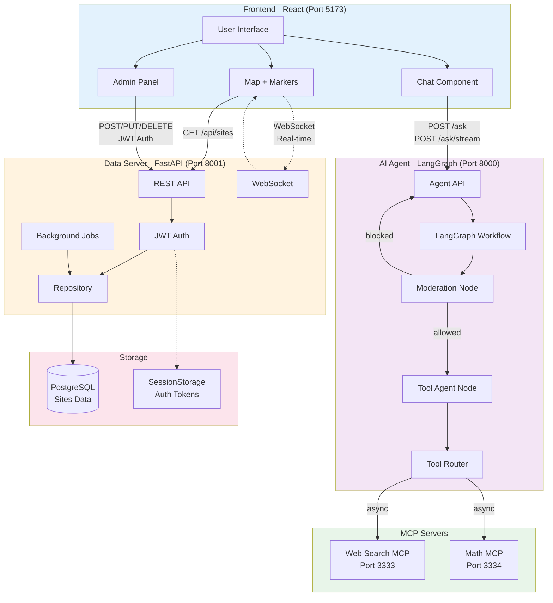

---

## 2. Data Flow - Complete System

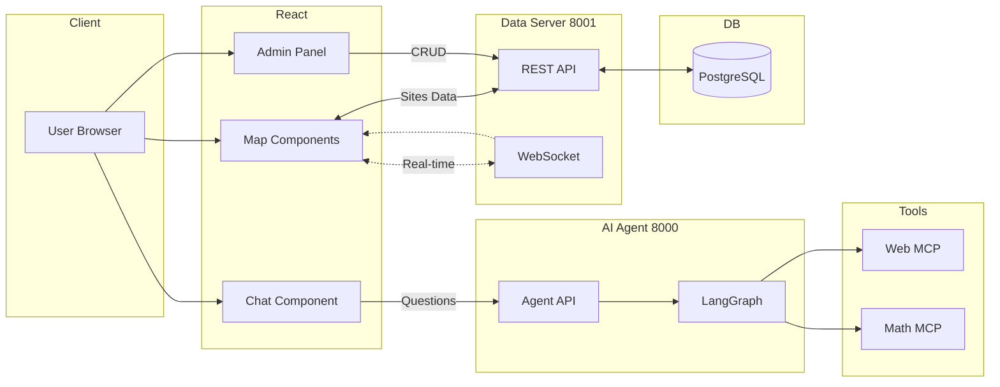

---

## 3. UC1: Login Flow

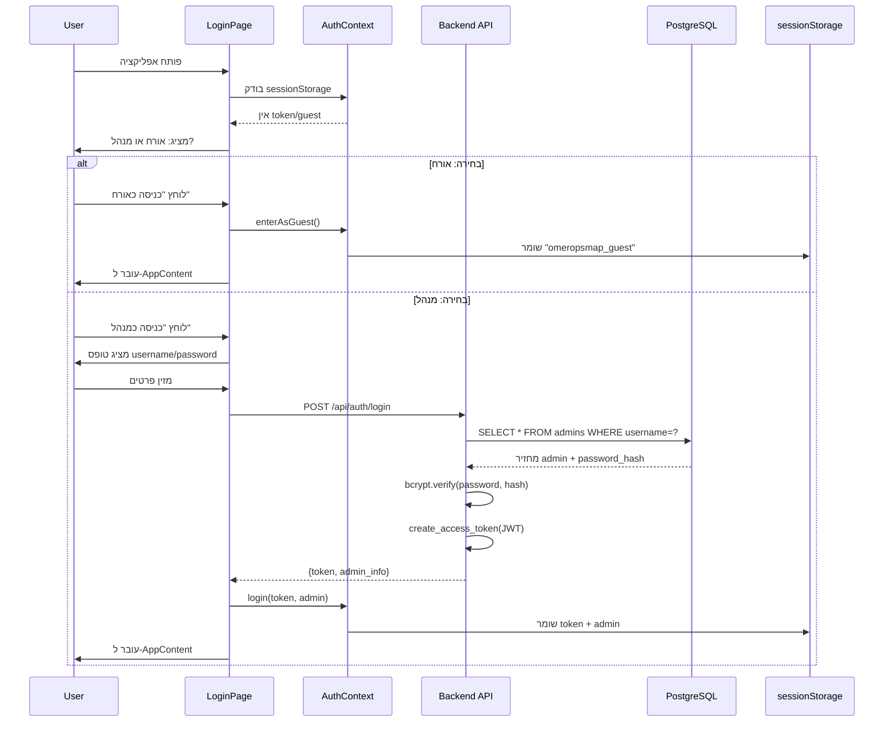

---

## 4. UC2: Data Loading

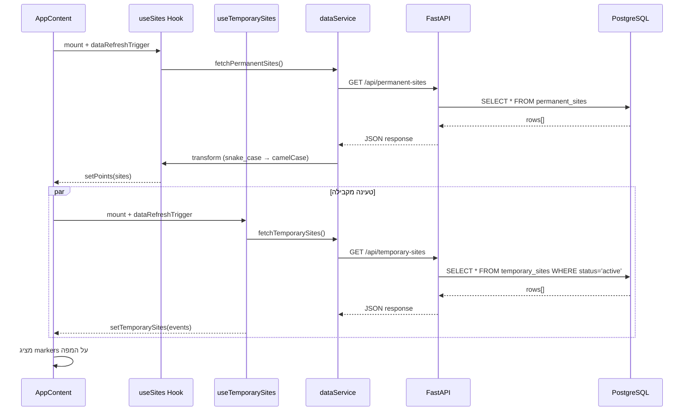

---

## 5. UC3: User Request Submission

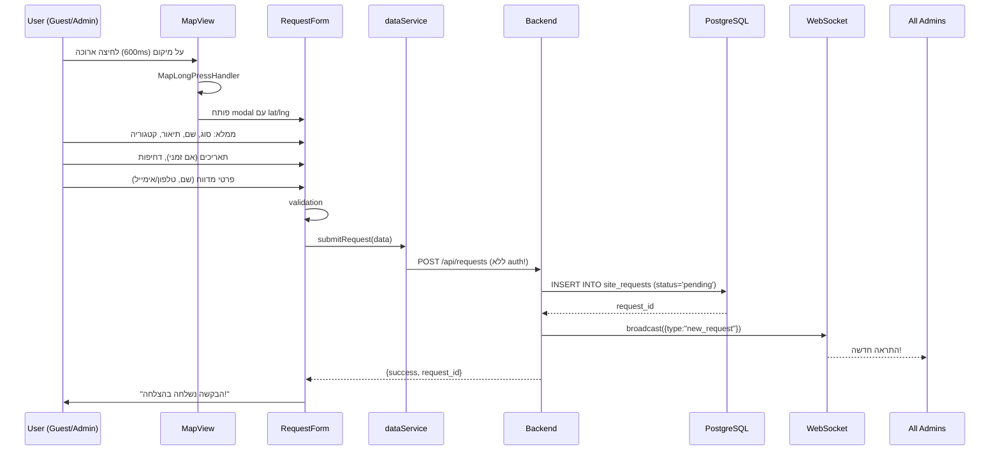

---

## 6. UC4: Admin Approve/Reject Request

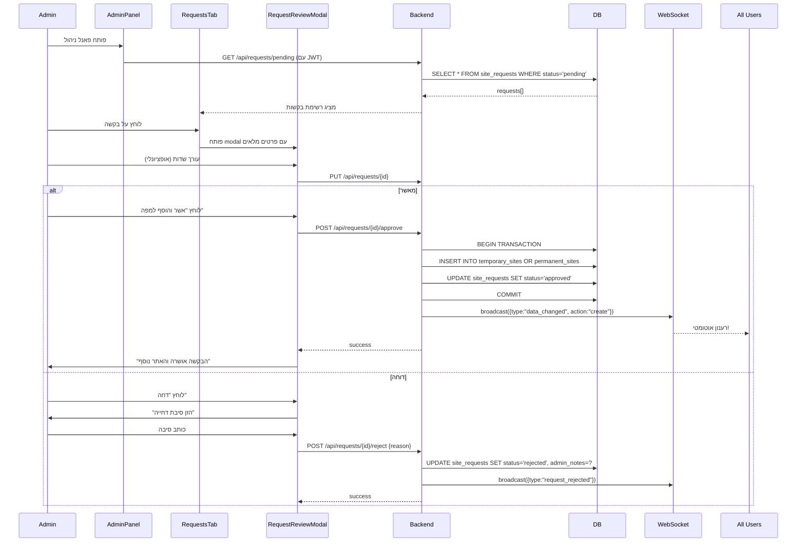

---

## 7. UC5: WebSocket Real-time Updates

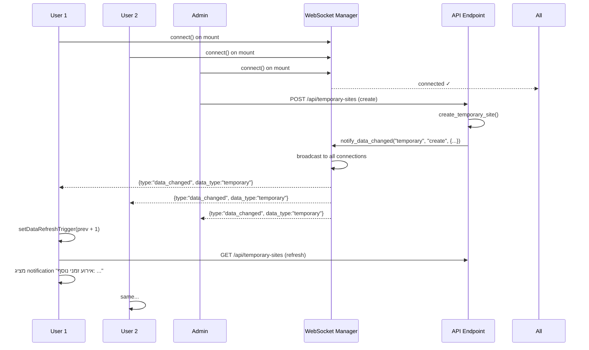

---

## 8. UC6: Expiry Scheduler

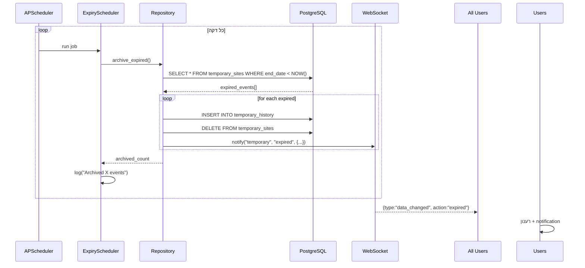

---

## 9. UC7: Admin CRUD Operations

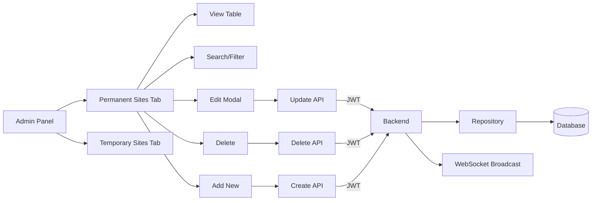

---

## 10. UC8: Logout Flow

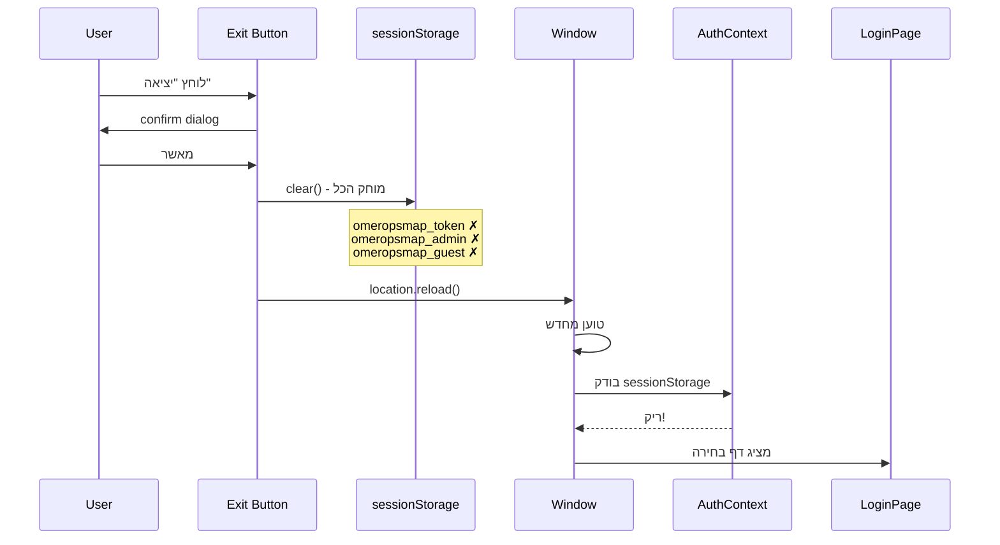

---

## 11. UC9: AI Chat Flow (NEW)

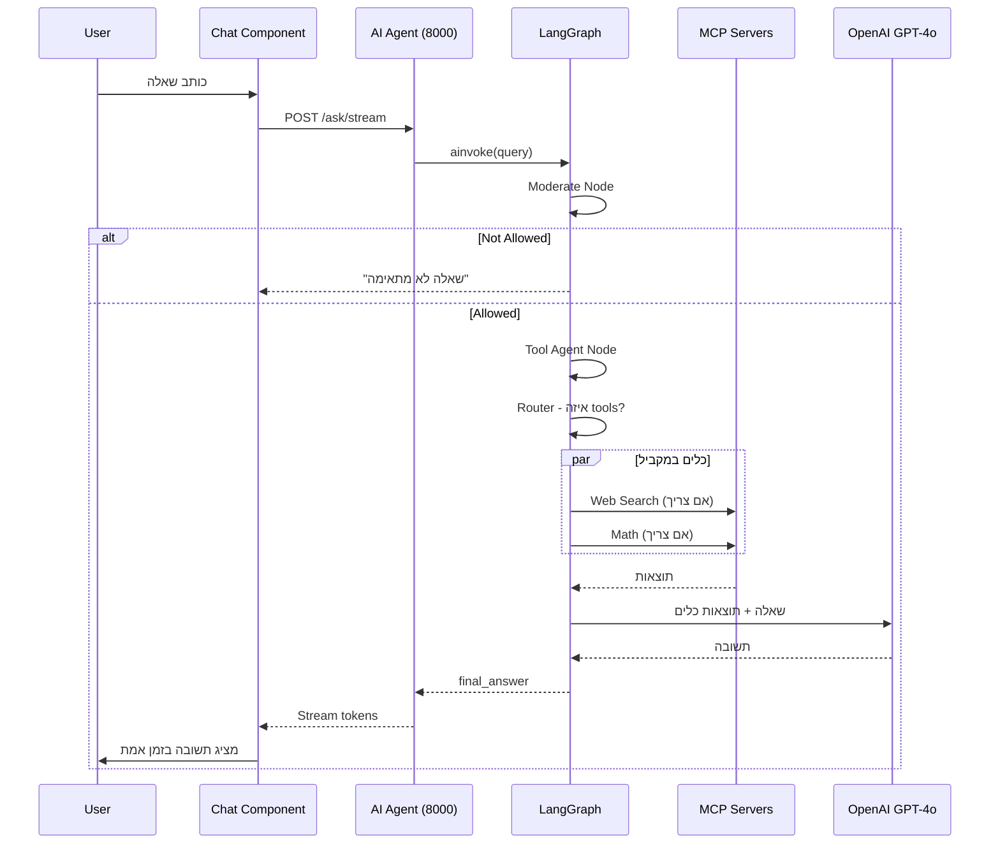

---

## 12. LangGraph Workflow

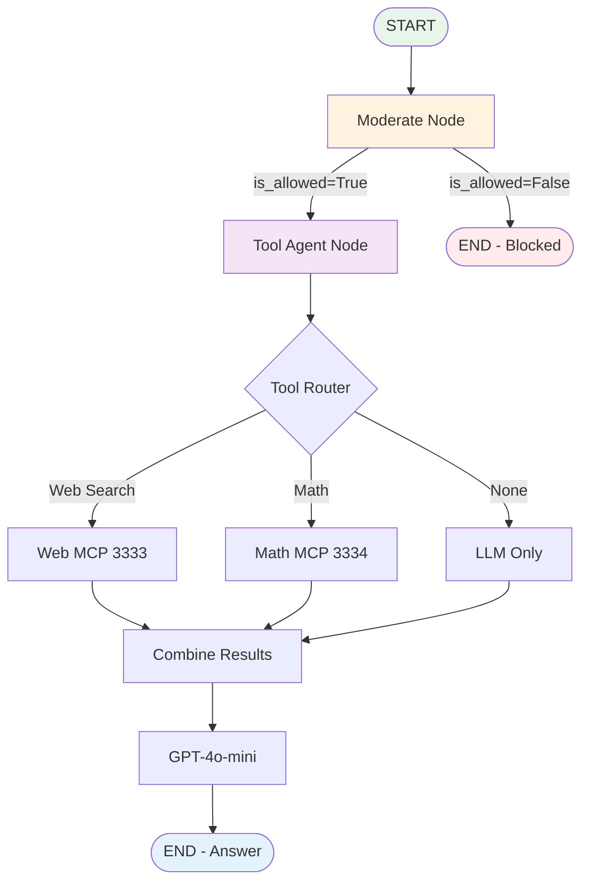

---

## 13. Component Hierarchy

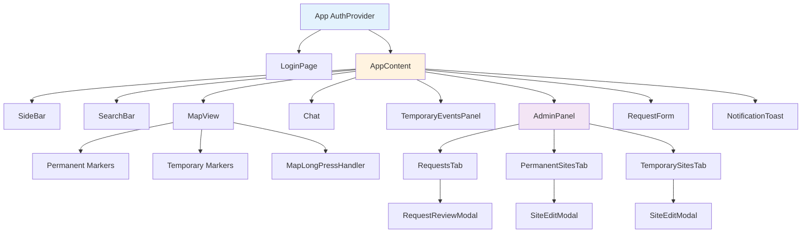

---

## 14. Database Schema

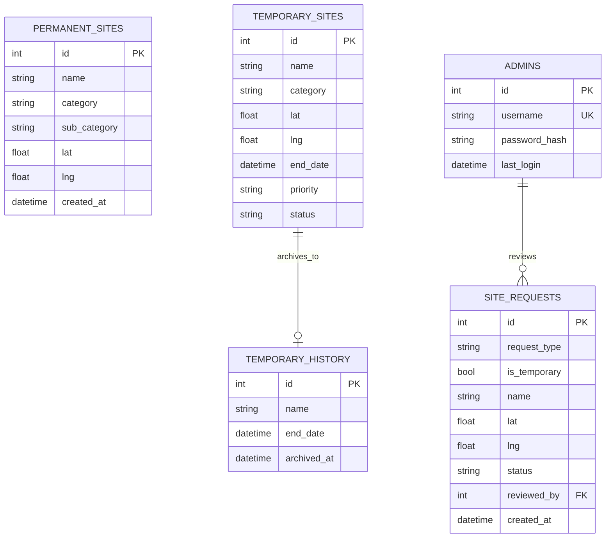

---

## 15. End-to-End Data Flow

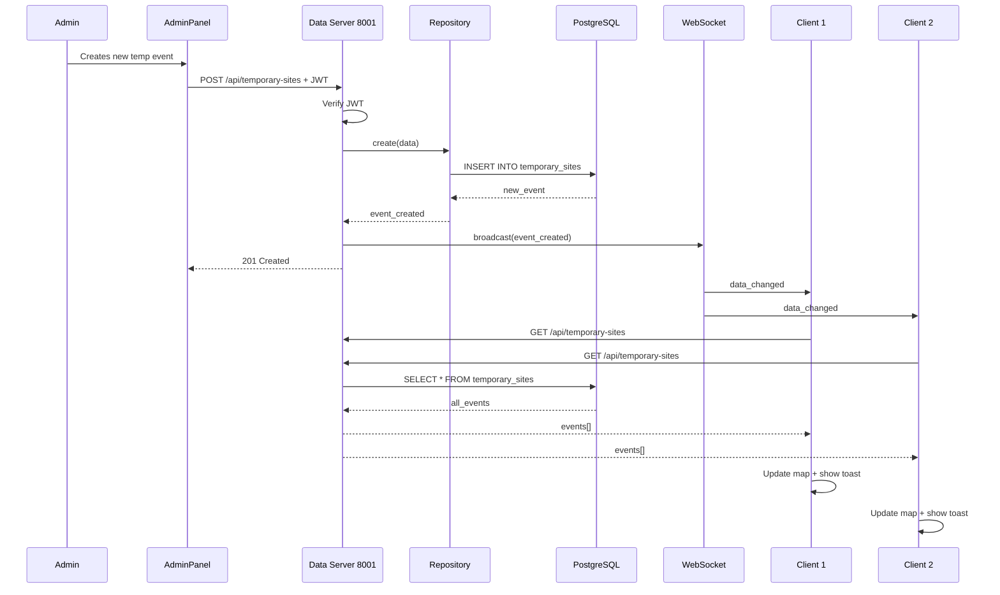

---

**End of Diagrams Collection**
*Ready to export as PNG/SVG images*

