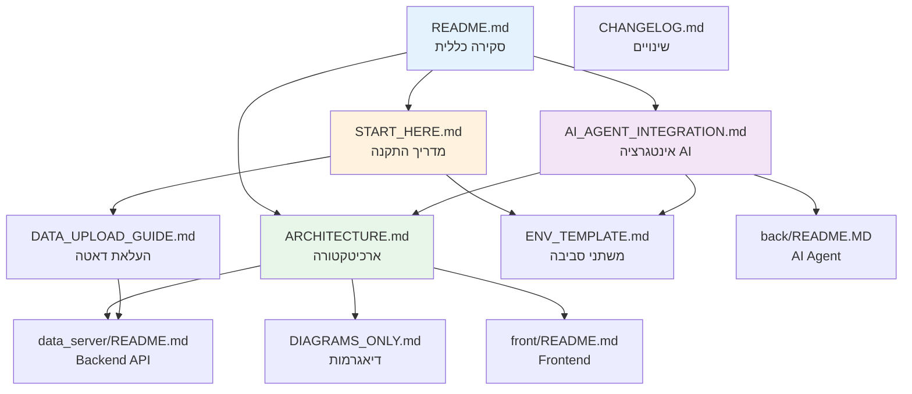

# 📚 OmerOpsMap - מדריך תיעוד מלא

> **אינדקס מרכזי** לכל התיעוד במערכת

---

## 🚀 התחלה מהירה

### למשתמשים חדשים
1. **[README.md](README.md)** - התחל כאן! סקירה כללית + Quick Start
2. **[START_HERE.md](START_HERE.md)** - מדריך התקנה והפעלה שלב-אחר-שלב

### למפתחים
1. **[ARCHITECTURE.md](ARCHITECTURE.md)** - ארכיטקטורה מלאה + Use Cases
2. **[AI_AGENT_INTEGRATION.md](AI_AGENT_INTEGRATION.md)** - מדריך אינטגרציה AI Agent

---

## 📖 תיעוד לפי נושא

### 🔧 התקנה והגדרה
| קובץ | תיאור | קהל יעד |
|------|--------|---------|
| [START_HERE.md](START_HERE.md) | מדריך התקנה מפורט מ-Clone עד אפליקציה עובדת | כולם |
| [ENV_TEMPLATE.md](ENV_TEMPLATE.md) | הסבר מפורט על כל משתני הסביבה | DevOps, מפתחים |

### 🏗️ ארכיטקטורה ועיצוב
| קובץ | תיאור | קהל יעד |
|------|--------|---------|
| [ARCHITECTURE.md](ARCHITECTURE.md) | ארכיטקטורה מלאה, Database Schema, Use Cases | מפתחים, ארכיטקטים |
| [DIAGRAMS_ONLY.md](DIAGRAMS_ONLY.md) | אוסף דיאגרמות Mermaid (ללא טקסט) | כולם |

### 📤 העלאת דאטה
| קובץ | תיאור | קהל יעד |
|------|--------|---------|
| [DATA_UPLOAD_GUIDE.md](DATA_UPLOAD_GUIDE.md) | מדריך מקיף: UI, CLI, API | מנהלים, מפתחים |

### 🤖 AI Agent
| קובץ | תיאור | קהל יעד |
|------|--------|---------|
| [AI_AGENT_INTEGRATION.md](AI_AGENT_INTEGRATION.md) | מדריך אינטגרציה מלא עם AI Agent | מפתח AI Agent |
| [back/README.MD](back/README.MD) | תיעוד AI Agent + MCP Servers | מפתח AI Agent |

### 🔌 API ורכיבים
| קובץ | תיאור | קהל יעד |
|------|--------|---------|
| [data_server/README.md](data_server/README.md) | תיעוד Backend API + Endpoints | Backend מפתחים |
| [front/README.md](front/README.md) | תיעוד Frontend + Components | Frontend מפתחים |

### 📝 תיעוד שינויים
| קובץ | תיאור | קהל יעד |
|------|--------|---------|
| [CHANGELOG.md](CHANGELOG.md) | רשימת כל השינויים במערכת | כולם |

---

## 🎯 מדריכים לפי תפקיד

### 👨‍💼 מנהל מערכת
1. [START_HERE.md](START_HERE.md) - התקנה
2. [DATA_UPLOAD_GUIDE.md](DATA_UPLOAD_GUIDE.md) - העלאת נתונים
3. [ENV_TEMPLATE.md](ENV_TEMPLATE.md) - הגדרות

### 👨‍💻 Backend Developer
1. [ARCHITECTURE.md](ARCHITECTURE.md) - הבנת המערכת
2. [data_server/README.md](data_server/README.md) - API Documentation
3. [DATA_UPLOAD_GUIDE.md](DATA_UPLOAD_GUIDE.md) - Data Flow

### 🎨 Frontend Developer
1. [ARCHITECTURE.md](ARCHITECTURE.md) - הבנת המערכת
2. [front/README.md](front/README.md) - Components & Hooks
3. [DIAGRAMS_ONLY.md](DIAGRAMS_ONLY.md) - Data Flow

### 🤖 AI Agent Developer
1. [AI_AGENT_INTEGRATION.md](AI_AGENT_INTEGRATION.md) - **התחל כאן!**
2. [back/README.MD](back/README.MD) - AI Agent Docs
3. [ARCHITECTURE.md](ARCHITECTURE.md) - System Overview

### 🚀 DevOps Engineer
1. [START_HERE.md](START_HERE.md) - Deployment
2. [ENV_TEMPLATE.md](ENV_TEMPLATE.md) - Environment Setup
3. [AI_AGENT_INTEGRATION.md](AI_AGENT_INTEGRATION.md) - Docker Compose

---

## 📊 מפת תיעוד - Dependency Graph

---

## 🔍 חיפוש מהיר

### איך...?

**...מתקינים את המערכת?**
→ [START_HERE.md](START_HERE.md)

**...מעלים נתונים חדשים?**
→ [DATA_UPLOAD_GUIDE.md](DATA_UPLOAD_GUIDE.md)

**...מחברים את ה-AI Agent?**
→ [AI_AGENT_INTEGRATION.md](AI_AGENT_INTEGRATION.md)

**...מגדירים environment variables?**
→ [ENV_TEMPLATE.md](ENV_TEMPLATE.md)

**...מבינים את הארכיטקטורה?**
→ [ARCHITECTURE.md](ARCHITECTURE.md)

**...עובדים עם ה-API?**
→ [data_server/README.md](data_server/README.md)

**...מפתחים בFrontend?**
→ [front/README.md](front/README.md)

**...רואים מה השתנה?**
→ [CHANGELOG.md](CHANGELOG.md)

---

## 📌 קבצים חשובים נוספים

### קבצי הגדרה
- `.env` - משתני סביבה (לא ב-Git)
- `.env.example` - תבנית למשתני סביבה
- `docker-compose.yml` - הגדרת Docker
- `package.json` - Dependencies של Frontend
- `requirements.txt` - Dependencies של Backend

### קבצי נתונים
- `front/public/sites.xlsx` - קובץ Excel לדוגמה
- `alembic/versions/` - Database migrations

---

## 🆕 עדכונים אחרונים

ראה [CHANGELOG.md](CHANGELOG.md) לרשימה מלאה של שינויים.

**עדכון אחרון:** 2026-01-11
- ✅ ניקוי קבצי תיעוד זמניים
- ✅ יצירת מדריך אינטגרציה AI Agent
- ✅ החזרת ChatBot component
- ✅ שיפור מערכת העלאת דאטה

---

## 📞 תמיכה

**מצאת שגיאה בתיעוד?** פתח issue או עדכן ישירות.

**שאלות?** בדוק קודם ב-[ARCHITECTURE.md](ARCHITECTURE.md) או ב-[START_HERE.md](START_HERE.md).

---

**גרסת תיעוד:** 1.0.0  
**עדכון אחרון:** 2026-01-11
